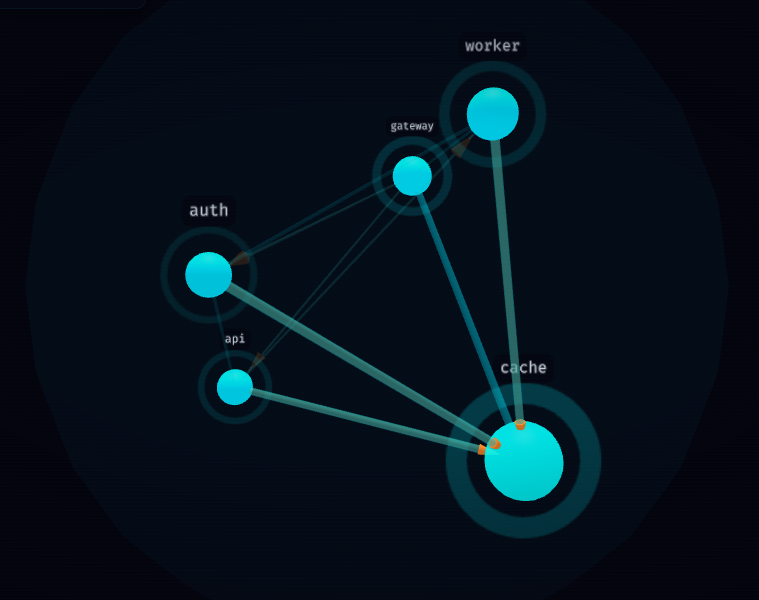
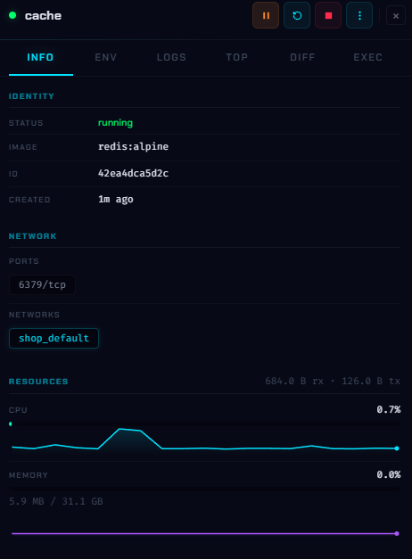
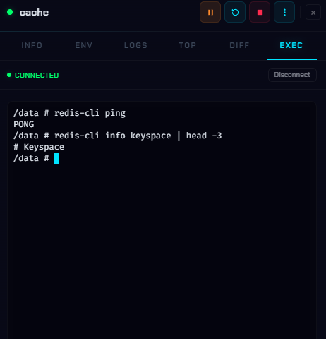
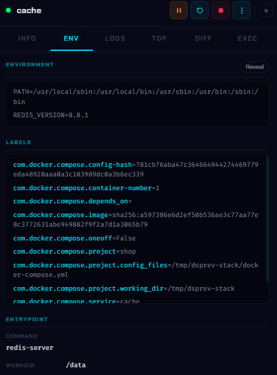
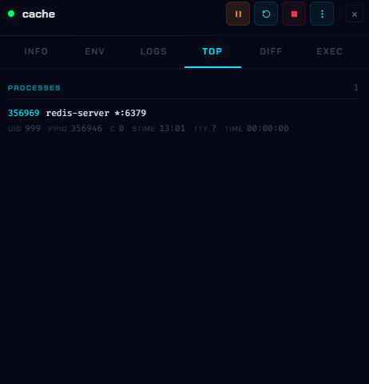
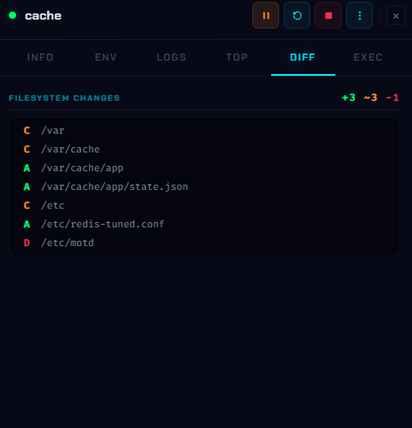
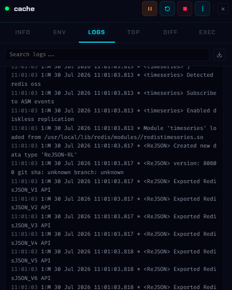

# DockScope

[](https://www.npmjs.com/package/dockscope)
[](https://github.com/ManuelR-T/dockscope/pkgs/container/dockscope)
[](https://github.com/ManuelR-T/dockscope/actions/workflows/ci.yml)
[](LICENSE)

**See your Docker stack instead of listing it.**

DockScope draws your containers as a live 3D dependency graph, then lets you dig
into any one of them: logs, metrics, a shell, and a guess at why it died.


## Run it

You need [Docker](https://docs.docker.com/get-docker/) running. That is the only
prerequisite. Either command below serves the dashboard at
**<http://localhost:4681>**, with nothing to configure and no account to make.

### Docker

The image is published at
[ghcr.io/manuelr-t/dockscope](https://github.com/ManuelR-T/dockscope/pkgs/container/dockscope).

```bash
docker run --name dockscope --restart unless-stopped -p 4681:4681 \
  -v /var/run/docker.sock:/var/run/docker.sock \
  -v dockscope-data:/data \
  ghcr.io/manuelr-t/dockscope
```

<details>
<summary>docker-compose.yml</summary>

```yaml
services:
  dockscope:
    image: ghcr.io/manuelr-t/dockscope
    container_name: dockscope
    restart: unless-stopped
    ports:
      - '4681:4681'
    volumes:
      - /var/run/docker.sock:/var/run/docker.sock
      - dockscope-data:/data

volumes:
  dockscope-data:
```

</details>

`dockscope-data` is what keeps a dashboard-set full-access token and installed
plugins. Without it they sit in the container's writable layer and vanish the
next time you recreate the container, pulling a new image for instance. See
[Where state lives](docs/configuration.md#where-state-lives).

To share an observational dashboard without handing out exec or mutation
access, configure distinct operator and reader secrets:

```bash
export DOCKSCOPE_TOKEN="$(openssl rand -hex 32)"
export DOCKSCOPE_READ_ONLY_TOKEN="$(openssl rand -hex 32)"

docker run --name dockscope --restart unless-stopped -p 4681:4681 \
  --env DOCKSCOPE_TOKEN \
  --env DOCKSCOPE_READ_ONLY_TOKEN \
  -v /var/run/docker.sock:/var/run/docker.sock \
  -v dockscope-data:/data \
  ghcr.io/manuelr-t/dockscope
```

Keep both values out of source control. The read-only token requires a
full-access token; DockScope refuses to start if it is configured alone.

Compose project management (up and down) is the one feature unavailable in a
container, since it cannot reach your host's compose files.

### With Node

No container, and it opens your browser for you:

```bash
npx dockscope up
```

Or `npm install -g dockscope` for a permanent `dockscope` command. This route
can manage Compose projects, since it runs on the host. Every flag it takes,
including `-H` to point at a remote Docker daemon, is in
[`dockscope up` options](docs/configuration.md#dockscope-up-options).

## What you can do with it

### Read the whole stack at a glance



Containers are spheres, coloured by health and wired together by `depends_on`
arrows and shared networks. Size is not decorative: it scales with how central a
container is, so the thing everything leans on is visibly the biggest. Compose
projects sit in their own enclosure, so a stack reads as one thing.

Search by name or image, filter by running, stopped or unhealthy, and colour the
links by network when you need to see the wiring rather than the workload.

### A container just died. Why?



DockScope reads the exit code, checks whether the kernel OOM-killed it, and
pulls the last log lines, then puts the likely cause in the sidebar instead of
making you piece it together from `docker inspect` and `docker logs`.

Spikes get caught the same way. CPU and memory are watched for outliers, so a
container that starts misbehaving pulses on the graph and raises an alert rather
than waiting for you to go looking.

### What breaks if I take this down?

Select a node and press `I`. Everything that depends on it lights up and the
rest of the graph dims. Useful before a restart, and useful when something is
already broken and you want the blast radius.

### What is actually going on in there?



Every container opens a sidebar of tabs: live logs with colour and in-log
search, an interactive shell, env vars with secrets masked, labels, mounts,
running processes, and the filesystem diff against the image.

| Environment and labels                                                                                                             | Processes                                                                                               |
| ---------------------------------------------------------------------------------------------------------------------------------- | ------------------------------------------------------------------------------------------------------- |
|              |  |
| **Filesystem diff**                                                                                                                | **Logs**                                                                                                |
|  |     |

Start, stop, restart, pause, kill and remove are all there, with a confirmation
step on the destructive ones. Whole Compose projects go up and down from the
project manager.

### Something broke last night and you missed it

Hit `REC` and DockScope records the graph, events and metrics into a JSON file.
Load that file on any other DockScope instance and replay it with a scrubber,
event markers and 1-8x speed. Live updates and actions are disabled during
replay, so a recording is safe to hand to someone else.

For a written postmortem, export the current view as PNG or SVG.

### It is not only Docker

Kubernetes ships as an official plugin that talks to your cluster directly, with
no `kubectl` needed. Deployments, StatefulSets, DaemonSets, Pods, Services,
Ingresses and HPAs render next to your containers, each pod attached to the
controller that owns it, with the same sidebar: metrics, env, logs and a shell.
Rollout restart, scale and delete included.

Install it from the Plugins panel, or write your own.

## Keyboard shortcuts

| Key             | Action                     |
| --------------- | -------------------------- |
| `/` or `Ctrl+K` | Focus search               |
| `Escape`        | Close panel, clear search  |
| `F`             | Zoom to fit                |
| `R`             | Reset camera               |
| `C`             | Center on selected node    |
| `I`             | Toggle impact view         |
| `Space`         | Play or pause replay       |
| `?`             | Show this list             |

## Is it safe to run?

On your own machine, yes, and that is the default: DockScope listens on
localhost only, and websites you visit cannot reach it.

Two things to know before you expose it anywhere:

- Operator access controls your Docker daemon, including shell access to
  containers. Treat an operator token as access to the host.
- Reader access prevents mutations and exec, but it still exposes sensitive
  logs, environment values, inspection data, filesystem diffs and process
  arguments. It is not anonymous or public access.
- The first time you open a reachable instance, it offers to set an access
  token. Take it. If you already run Authelia, Authentik, oauth2-proxy or
  Cloudflare Access, DockScope can use that instead.

[**SECURITY.md**](.github/SECURITY.md) has the full picture.

## Documentation

| Guide                                            | What is in it                                       |
| ------------------------------------------------ | --------------------------------------------------- |
| [Configuration](docs/configuration.md)           | Every CLI flag, environment variable and state file |
| [Security](.github/SECURITY.md)                  | Access tokens, reverse proxy auth, the threat model |
| [HTTP API](docs/api.md)                          | Every endpoint, and the WebSocket messages          |
| [Writing plugins](docs/plugins.md)               | Build your own data source, panel or action         |
| [Publishing plugins](docs/plugin-publishing.md)  | Package, sign and distribute one through a catalog  |
| [Operating plugins](docs/plugin-operations.md)   | Loading, permissions, health and quarantine         |
| [Contributing](CONTRIBUTING.md)                  | Development setup and how to send a PR              |
| [Roadmap](ROADMAP.md)                            | Where this is going, and what needs doing           |

## Contributing

Contributions are welcome, and there is a short list of issues tagged
[good first issue][gfi] that are self-contained enough to pick up cold. Larger
open work is tagged [help wanted][hw], and [ROADMAP.md](ROADMAP.md) groups it
all by theme.

```bash
git clone https://github.com/ManuelR-T/dockscope.git
cd dockscope
npm install
npm run dev
```

[CONTRIBUTING.md](CONTRIBUTING.md) covers the rest. Bug reports count too.

Built with Svelte 5, Three.js and Express. No account, no telemetry, no cloud.

[gfi]: https://github.com/ManuelR-T/dockscope/issues?q=is%3Aissue+is%3Aopen+label%3A%22good+first+issue%22
[hw]: https://github.com/ManuelR-T/dockscope/issues?q=is%3Aissue+is%3Aopen+label%3A%22help+wanted%22

## License

[MIT](LICENSE)
